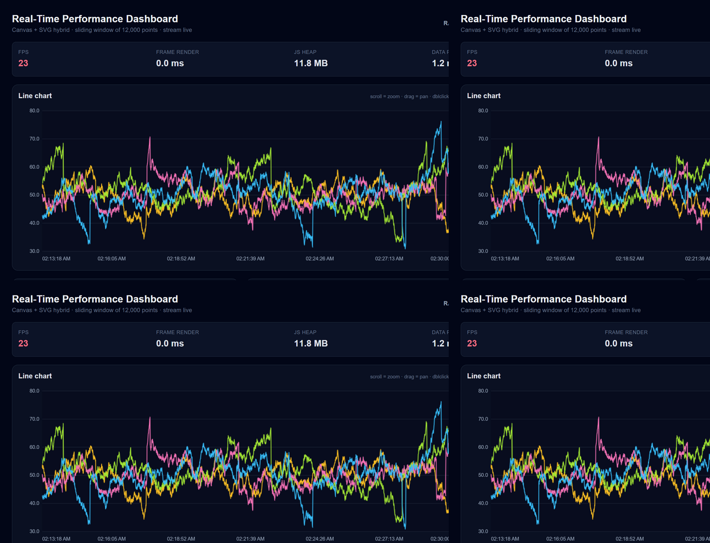
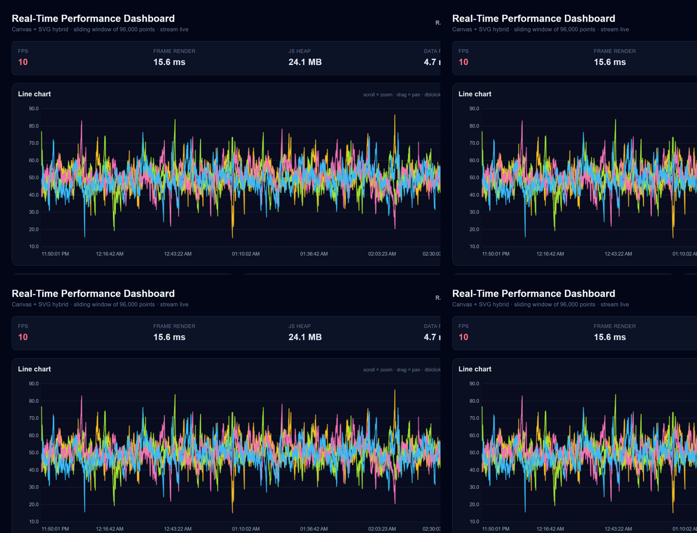

# Performance-Critical Data Visualization Dashboard

A real-time dashboard that renders **10,000+ live data points at 60fps**, built with **Next.js 14 App Router + TypeScript**. All charts are built **from scratch on Canvas + SVG** — no Chart.js, no D3.

## Features



- **4 chart types**: line chart, bar chart, scatter plot (with hover tooltip), and a time×category heatmap
- **Real-time stream**: new data every 100ms (configurable, plus a 5× points / 4× frequency stress mode)
- **Interactions**: scroll-to-zoom and drag-to-pan on the line chart (pinch-zoom on touch devices, double-click resets), category filtering, time range presets (30s / 1m / 5m / All), aggregation (raw / 1min / 5min / 1hour)
- **Scales to 200k points**: sliding window up to 200k with a one-click **fill window now** stress button — verified live at 192k points
- **Virtualized data table**: newest-first, only visible rows render
- **Performance HUD**: live FPS, frame render time, JS heap usage, data-processing time, point count
- **Responsive layout**: desktop → tablet → mobile via CSS grid



## Setup

```bash
npm install
npm run dev        # dev server on http://localhost:3000
```

Production:

```bash
npm run build
npm start
```

Open **http://localhost:3000/dashboard**.

## Performance Testing

1. Open the dashboard in Chrome (the FPS counter needs a foreground, unthrottled tab).
2. Watch the HUD: FPS should hold ~60 with the default 12k-point window.
3. **Stress test:** click **window** up to 200k and hit **fill window now** to jump straight to 100k+/200k points, and/or toggle **Enable stress test** (5× points at 4× frequency). Frame render stays single-digit-to-low-double-digit ms — well inside the 60fps budget.
4. Memory: open DevTools → Memory, note JS heap in the HUD, leave the stream running for 10+ minutes — usage stays flat because of the sliding window.
5. Interactions: scroll/pinch to zoom, drag to pan, filter while streaming; the HUD's "Frame render" stays in single-digit ms.
6. Bundle: `npm run build` prints per-route sizes (dashboard ≈ 96 KB first-load JS, well under the 500 KB budget).

API smoke test: `curl "http://localhost:3000/api/data?count=1000"`.

## Browser Compatibility

- Chrome / Edge 100+ (full: DPR-aware canvas, ResizeObserver, `performance.memory` HUD)
- Firefox 100+ (everything except the heap display — `performance.memory` is Chromium-only, HUD shows `n/a`)
- Safari 15+ (same heap caveat)
- Mobile Chrome/Safari: responsive layout works; very large windows may reduce FPS on low-end devices

## Architecture (Next.js specifics)

| Decision | Why |
| --- | --- |
| `/dashboard` is a **Server Component** that generates the initial 10k dataset at build time (static prerender) | instant first paint, zero client data-fetch on load |
| All interactivity lives in **Client Components** under `components/` (`'use client'`) | charts need canvas, refs, and the live stream |
| Initial data flows server → client through the `DataProvider` context once; the live feed is appended client-side | no polling, no hydration mismatch (generator is seeded) |
| `app/api/data/route.ts` route handler serves generated datasets (`?count=`, `?seed=`) | contract for a real backend; dynamic, no-store |
| `loading.tsx` + `error.tsx` boundaries | streaming skeleton and graceful recovery with retry |
| State: React hooks + Context + `useReducer` only (per assignment: no external state libraries), split into a **high-frequency data context** and a **low-frequency settings context** | streaming data never re-renders settings-only components (verified in React DevTools Profiler) |
| Aggregation / time-range switches wrapped in `useTransition` | heavy recomputes never block input |

## Project Structure

```
app/
  dashboard/{page,layout,loading,error}.tsx   # App Router pages + boundaries
  api/data/route.ts                           # data API
components/
  charts/     LineChart, BarChart, ScatterPlot, Heatmap (+ shared chartTheme)
  controls/   FilterPanel, TimeRangeSelector
  ui/         DataTable (virtualized), PerformanceMonitor (HUD)
  providers/  DataProvider (context + reducer)
  DashboardShell.tsx
hooks/  useDataStream, useChartRenderer, usePerformanceMonitor, useVirtualization, useMemoizedAggregation
lib/    dataGenerator, canvasUtils, performanceUtils, types
```

See **PERFORMANCE.md** for benchmarking results and the full optimization write-up.
